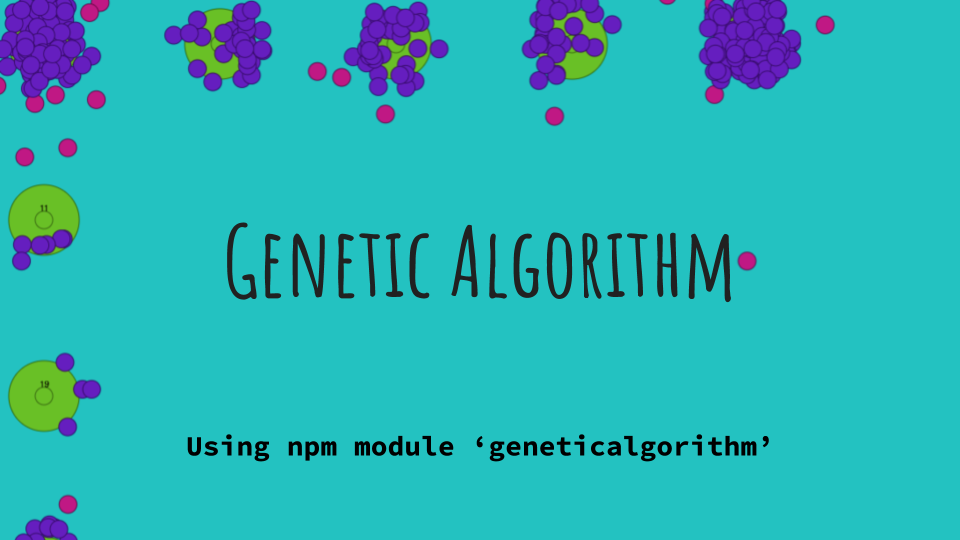

[![Downloads][downloads-image]][downloads-url] [![Auto Test Status][travis-image]][travis-url] [![license][license-image]][license-url] [![Gitter chat][gitter-image]][gitter-url]

[Watch the demo video](https://youtu.be/kYFz03Cg3-A)

[](https://youtu.be/kYFz03Cg3-A)

Genetic Algorithms are an attempt to mimic the benefits of Evolution.  This package provides the calculation framework to execute and mimic artificial evolution.  Genetic Algorithms have been used to solve many problems in Engineering and Mathmatics both for fun and profit.

A naive implementation will try and maximize a fitness function by applying mutations and cross-over but fail to implement some diversity metric.  What happens without a diversity metric is that most likely all your phenotypes will clump into one local optimia.  When a diversity metric is added then a few phenotypes are allowed to 'explore' the local solution space without having to compete with the majority of the population that is overfit to a local maxima.  Adding a diversity metric will allow these 'explorers' to avoid competition until they find something even better.

To add diversity use the [doesABeatBFunction](#doesABeatBFunction) function instead of the [fitnessFunction](#fitnessFunction) and only allow A to beat B if A is more fit than B and B is close enough.  See the [Islands](#Islands) example for sample code.

Section Links : [Construction](#construction) , [Execution](#execution) , [Examples](#examples) , [Phenotype](#phenotype) , [FAQ](#faq) , [Related](#related-ai-projects) , and [References](#references)

# Construction
### GeneticAlgorithm constructor
```js
var GeneticAlgorithmConstructor = require('geneticalgorithm')
var geneticalgorithm = GeneticAlgorithmConstructor( config )
```
The minimal configuration for constructing an GeneticAlgorithm calculator is like so:

```js
var config = {
    mutationFunction: aMutationFunctionYouSupply,
    crossoverFunction: yourCrossoverFunction,
    fitnessFunction: yourFitnessFunction,
    doesABeatBFunction: yourCompetitionFunction,
    population: [ /* one or more phenotypes */ ],
    populationSize: aDecimalNumberGreaterThanZero 	// defaults to 100
}
var GeneticAlgorithmConstructor = require('geneticalgorithm')
var geneticalgorithm = GeneticAlgorithmConstructor( config )
```

That creates one instance of an GeneticAlgorithm calculator which uses the initial configuration you supply.  All configuration options are optional except *population*.  If you don't specify a crossover function then GeneticAlgorithm will only do mutations and similarly if you don't specify the mutation function it will only do crossovers.  If you don't specify either then no evolution will happen, go figure.

That is all the configuration you need to get started.  You can skip the next sections on advanced configuration and jump right to [execution](#execution), [functions](#functions) and [examples](#example).


### geneticalgorithm.clone( )
Create another GeneticAlgorithm calculator based off of an existing configuration.

```js
var anotherGA = geneticalgorithm.clone()
```

### geneticalgorithm.clone( config )
Create another GeneticAlgorithm calculator based off of an existing configuration and override some or all of the configuration

```js
var anotherWithLargePopulation = geneticalgorithm.clone({
	populationSize : 1000
})
```

### geneticalgorithm.config()
Get the current configuration of a GeneticAlgorithm.  All defaults will be populated.  Can be used for debugging or populating a new or clone GeneticAlgorithm.  A clone GeneticAlgorithm with 10% larger population size could be created like so:
```js
var size = geneticalgorithm.config().populationSize
var biggerGeneticAlgorithm = geneticalgorithm.config({
	populationSize = size * 1.10
})
```

# Execution

### geneticalgorithm.evolve( )
Do one generation of evolution like so
```js
geneticalgorithm.evolve( )
```
The *.evolve()* moves the calculator ahead by one generation.  Depending on the population size and the speed of the functions you provide in the configuration this coupld be quick or take some time.
*.evolve()* changes the geneticalgorithm and also returns it.  This is for simplicity so that you could do chain calls like so
```js
geneticalgorithm.evolve().evolve().best()
```
to do two evolutions and then get the best phenoType (see *.best()* below).

### geneticalgorithm.evolve( config )
Same as *.evolve()* but change the configuration prior to running the evolution calculations.  In this example the populationSize is increased to 200:
```js
geneticalgorithm.evolve( {
	populationSize : 200
} )
```

### geneticalgorithm.best()
Retrieve the Phenotype with the highest fitness score like so
```js
var best = geneticalgorithm.best()
```

### geneticalgorithm.bestScore()
Retrieve the score of the best Phenotype like so
```js
var best = geneticalgorithm.bestScore()
```

### geneticalgorithm.population()
Retrieve the whole population like so
```js
var phenotypeList = geneticalgorithm.population()
```

### geneticalgorithm.scoredPopulation()
Retrieve the whole population wrapped in a score object like so
```js
var scoreList = geneticalgorithm.scoredPopulation()
console.log( scoreList[0].phenotype )
console.log( scoreList[0].score )
```
The result of *.scoredPopulation* is the following data structure
```js
result = { phenotype : anItem , score : aNumber }
```

# Functions
This is the specification of the configuration functions you pass to GeneticAlgorithm

### mutationFunction(phenotype)
> Must return a phenotype

The mutation function that you provide.  It is a synchronous function that mutates the phenotype that you provide like so:
```js
function mutationFunction (oldPhenotype) {
	var resultPhenotype = {}
	// use oldPhenotype and some random
	// function to make a change to your
	// phenotype
	return resultPhenotype
}
```

### crossoverFunction (phenoTypeA, phenoTypeB)
> Must return an array [] with 2 phenotypes

The crossover function that you provide.  It is a synchronous function that swaps random sections between two phenotypes.  Construct it like so:
```js
function crossoverFunction(phenoTypeA, phenoTypeB) {
	var result1 = {} , result2 = {}
	// use phenoTypeA and B to create phenotype result 1 and 2
	return [result1,result2]
}
```

###  fitnessFunction (phenotype)
> Must return a number

```js
function fitnessFunction(phenotype) {
	var fitness = 0
	// use phenotype and possibly some other information
	// to determine the fitness number.  Higher is better, lower is worse.
	return fitness;
}
```

### doesABeatBFunction (phenoTypeA, phenoTypeB)
> Must return truthy or falsy

This function, if specified, overrides using simply the fitness function to compare two phenotypes.  There are situations where you will want to preserve a certain amount of genetic diversity and so your doesABeatBFunction can return false if the two phenotypes are too different.  When GeneticAlgorithm is comparing two phenoTypes it *only* tests if A can beat B and if so then B dies and is replaced with a mutant or crossover child of A.  If A cannot beat B then nothing happens.  This is an important note to consider.  Suppose A and B are very genetically different and you want to preserve diversity then in your *doesABeatBFunction* you would check how diverse A and B are and simply return falsy if it crosses your threshold.

The default implementation if you don't supply one is:
```js
function doesABeatBFunction(phenoTypeA, phenoTypeB) {
	return fitnessFunction(phenoTypeA) >= fitnessFunction(phenoTypeB)
}
```
Imagine you have implemented a *yourDiversityFunc(phenoTypeA, phenoTypeB)* that returns some numeric value and you've identified that some *MINIMUM_SIMILARITY* value is necessary for A and B to even be compared otherwise you want to preserve both.  Your implementation may look something like this
```js
function doesABeatBFunction(phenoTypeA, phenoTypeB) {

  // if too genetically different to consider
  if ( yourDiversityFunc(phenoTypeA, phenoTypeB) > MINIMUM_SIMILARITY ) {
    return false; 
  }

  // if phenoTypeA isn't better than phenoTypeB 
  if ( fitnessFunction(phenoTypeA) =< fitnessFunction(phenoTypeB) ) {
    return false;
  }

  // else phenoTypeA beats phenoTypeB
  return true;
}
```


# Examples
If you have installed this as a npm dependency first change directory to *node_modules/geneticalgorithm/*.

### Template
The template is a boiler plate of how to get started.  It has a dummy phenotype and all the functions stubbed out.  Execute it like so:
```
node examples/template.js 
```

### Islands
One issue that arrises is when there are local maxima and the genetic algorithm gets stuck on it and does not explore and find the global maxima.  In this example there are 25 local maxima but only one global maxima.  One phenotype starts near the worst local maxima and after a few generations the genetic algorithm is able to find the global maxima.

The command line example.
```
node examples/islandHop.js
```

There is also a web example.  Use something like `http-server -p 8000` or another web server.
Then go to (/examples/islandHop.html)[http://localhost:8000/examples/islandHop.html]


### Traveling Salesmen
For a list of XY coordinates, find the order that results in the least distance being traveled.  Run the example like so:
```
node examples/travelingSalesmen.js
```


### Fixed Number Array
Execute the *Fixed Number Array* example.  This example shows how to use the basic configurations.  It starts with one array of zeros.  The objective is to evolve the array of zeros to an array of 50's. Run the example using the command line like so:

```
# use the default of 10 numbers in the number array
node examples/fixedNumberArray.js

# change the array to be 30 numbers long
node examples/fixedNumberArray.js 30
```

### Variable Number Array
This is similar to the Fixed Number Array.  The key difference is that the number array can mutate to be longer or shorter.  It starts as the list [0,0,0].  The objective is to evolve the array to the target size with all values equal to 50.  This is a great example if you are searching for a list of values but you also don't know how long the list needs to be.  Run the example using the command line like so:
```
# use the default of 5 as the target length
node examples/variableNumberArray.js

# use 15 as the target length
node examples/variableNumberArray.js 15
```

# Phenotype
What is a phenotype?  Any json object you want.  GeneticAlgorithm doesn't care.  Chose something that works well for your particular problem and your helper functions: mutation, crossover, and fitness.  A phenotype could be a list of numbers, a dictionary of words, or a matric of boolean values.  It must be a json object though.

# FAQ
**What is a phenotype?**  A phenotype is a fancy name for the thing you want to evolve.  Perhaps it is a list of numbers or a configuration file or a micro-instruction language.  The key is that it is a json object and is the thing you want to evolve.  It is just data.  If it was called 'the data' instead of phenotype then it would get confusing when we want to talk about other data besides the thing we are trying to evolve.  The name phenotype comes from evolution.  If you are interested in that sort of thing Wikipedia has a great write up.


# Related AI Projects
This is part of a set of related projects.

* [AlphaBeta](https://www.npmjs.com/package/alphabeta)
* [Boosting](https://www.npmjs.com/package/boosting)
* [GeneticAlgorithm](https://www.npmjs.com/package/geneticalgorithm)
* [NearestNeighbour](https://www.npmjs.com/package/nearestneighbour)
* [NeuralNet](https://www.npmjs.com/package/neuralnet)

# References

* [Instructor: Patrick Winston from MIT](http://www.youtube.com/v/kHyNqSnzP8Y)
* [Wikipedia entry for Minimax](https://en.wikipedia.org/wiki/Genetic_Algorithm)


[gitter-url]: https://gitter.im/panchishin/geneticalgorithm
[gitter-image]: https://badges.gitter.im/panchishin/geneticalgorithm.png

[downloads-image]: http://img.shields.io/npm/dm/geneticalgorithm.svg
[downloads-url]: https://www.npmjs.com/~panchishin

[travis-url]: https://travis-ci.org/panchishin/geneticalgorithm
[travis-image]: http://img.shields.io/travis/panchishin/geneticalgorithm.svg

[license-image]: https://img.shields.io/badge/license-Unlicense-green.svg
[license-url]: https://tldrlegal.com/license/unlicense

